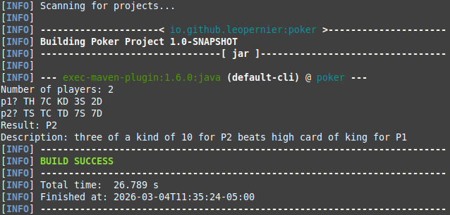
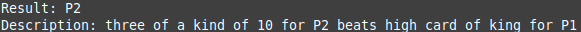

<!-- PROJECT SHIELDS -->
<p align="center">
  
  
  
  <a href="LICENSE"></a>
</p>

<h1 align="center">Poker Hand Evaluator</h1>

<p align="center">
  Command-line poker arbiter that compares 2+ five-card hands and prints a readable winner explanation (or tie).
</p>

---

## Overview

This project parses and validates multiple 5 cards poker hands, ranks them, and determines the winner(s). It’s a small Java CLI that focuses on clean modeling, a pluggable evaluation pipeline, and deterministic tie-breaking via comparable rank objects. Built to be easy to read, test, and extend.

---

## Demo

Below are two runs of the CLI: **interactive mode** and **args mode**.

### 1) Interactive mode

```bash
mvn exec:java
```



### 2) Args mode

```bash
mvn -q exec:java -Dexec.args='"TH 7C KD 3S 2D" "TS TC TD 7S 7D"'
```



---

## Features

- **Multi-player arbitration**: Compare **2+ hands** in a single run and return the winner(s), also supports ties.
- **Two run modes**:
  - **Interactive mode**: Enter number of players and the hands via prompts.
  - **Args mode**: Pass each hand as an argument.
- **Strict input validation**:
  - Exactly **5 cards** per hand.
  - No duplicate cards in a hand.
  - Clear errors for malformed ranks/suits.
- **Extensible evaluation design**: Ordered evaluator pipeline.
- **Deterministic comparisons**: Each hand maps to a `HandRank` that implements `Comparable` for clean winner selection.

---

## Supported hand types

This implementation currently evaluates (highest to lowest):

1. Flush
2. Straight
3. Three of a Kind
4. Pair
5. High Card

> Note: More hand types will be added in future updates.

---

## Card format

Each card is two characters: `<RANK><SUIT>`

- Ranks: `1 2 3 4 5 6 7 8 9 T J Q K`
- Suits: `C` (Clubs), `D` (Diamonds), `H` (Hearts) and `S` (Spades)

> Note: Ace is `1` and not `A` in this project.

Example hand:

`TH 7C KD 3S 2D`

---

## Tech Stack

- **Language:** Java 8
- **Build:** Maven
- **Testing:** JUnit 4.12

---

## Getting Started

### Prerequisites

- Java 8+
- Maven 3+

### Run Locally

#### 1) Run tests

```bash
mvn -q test
```

#### 2) Interactive mode

```bash
mvn -q exec:java
```

Then follow the prompts:

```txt
Number of players: 3
p1? TH 7C KD 3S 2D
p2? 2H 5H 7H 9H JH
p3? KC 9D 7S 4C 2D
```

#### 3) Args mode

Each hand must be passed as one quoted argument.

```bash
mvn -q exec:java -Dexec.args='"TH 7C KD 3S 2D" "TS TC TD 7S 7D"'
```

You can pass more players the same way:

```bash
mvn -q exec:java -Dexec.args='"TH 7C KD 3S 2D" "2H 5H 7H 9H JH" "KC 9D 7S 4C 2D"'
```

---

## Project Structure

```txt
src/
 ├── main/java/io/github/leopernier/poker/
 │   ├── Main.java                  # CLI + input/output
 │   ├── Arbiter.java               # Ranks hands + selects winner(s)
 │   ├── evaluator/                 # Hand detectors
 │   ├── model/                     # Card, Hand
 │   ├── rank/                      # Comparable rank objects
 │   └── enums/                     # Rank, Suit
 └── test/java/io/github/leopernier/poker/
     └── MainTest.java              # Arbiter scenarios + tie cases
_models/                            # PlantUML diagrams
Makefile                            # Diagram generation helpers
assets/                             # Demo images
README.md
pom.xml
LICENSE
```

---

## Design Notes

- **Pipeline evaluation**: `Arbiter` tries evaluators in priority order and assigns the first matching `HandRank`.
- **Comparable ranks**: Each rank type (e.g. `FlushRank` or `StraightRank`) implements consistent comparison so the arbiter can simply compute `max()` to find the best hand.
- **Model invariants**:
  - `Hand` enforces exactly 5 cards and no duplicates.
  - `Card.fromString()` validates rank/suit at parse time.
- **Extending the game**:
  - Add a new evaluator in `evaluator/`.
  - Add a new rank object in `rank/`.
  - Register the evaluator in `Arbiter`’s constructor, at the correct priority.

---

## License

Distributed under the MIT License. See `LICENSE` for more information.
